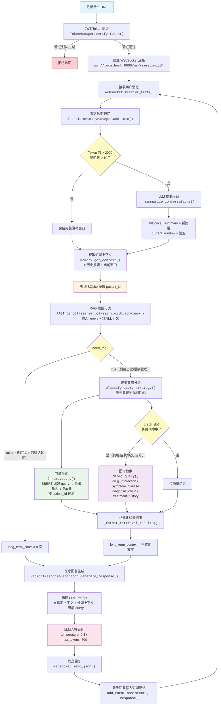
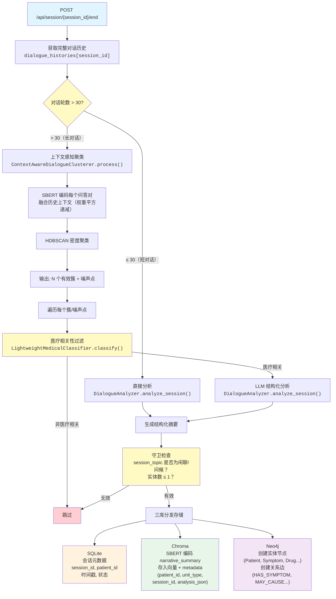

# 智能医疗对话记忆管理系统

> 基于 LLM 的医疗对话系统，具备**短期记忆**、**长期记忆**和**智能 RAG 检索**能力，为患者提供跨会话的个性化医疗咨询体验。

## 应用场景

患者预约门诊后收到一个唯一 URL，点击即可进行初始咨询。系统会记住患者的历史对话，在复诊时提供个性化的答疑，同时帮助医生快速了解患者情况。会话结束后 URL 自动失效，保障安全性。

---

## 项目演示

### Step 0：外部医疗系统填写患者信息

模拟外部 HIS 系统，填入患者基本信息（ID、姓名、年龄、性别、主治医生、科室、预约号）。


### Step 1：创建会话，生成唯一访问 URL

系统创建 Session，生成带 JWT Token 的一次性 URL，发送给患者。URL 带有过期时间，会话结束后不可再次访问。


### Step 2：患者点击 URL 进入对话界面

患者点击链接进入在线问诊页面，显示患者姓名、主治医生和科室信息，WebSocket 连接建立。


### Step 3：短期记忆测试 —— 会话内上下文连续性

患者提问"你好我头疼谢谢"，接着问"好的，我刚才怎么了？"。系统通过滑动窗口短期记忆，准确回忆起当前会话中刚才提到的头痛症状，无需检索长期记忆。


### Step 4：后端日志 —— RAG 意图分类与患者 ID 提取

后端日志显示：RAG 意图分类器判断两次提问均为 `need_rag: False`（新症状描述和当前对话延续，短期记忆即可满足），同时正确提取并关联了患者 ID。


### Step 5：会话结束 —— Session 信息总结与长期记忆存储

会话结束后，系统自动分析对话内容，生成结构化摘要：对话主题（Patient consultation for headache symptoms）、完整摘要、主诉关键词，以及实体和关系数量统计。这些信息被分发存储到 SQLite、Chroma 和 Neo4j。


### Step 6：复诊 —— 使用相同患者 ID 创建新会话

使用相同的患者 ID（P1773764051539）创建新的 Session，模拟患者复诊场景。系统为同一患者生成新的访问 URL。


### Step 7：长期记忆测试 —— 跨会话个性化回复

患者在新会话中问"我上次来看病发生了什么？"。RAG 意图分类器判断 `need_rag: True`，系统从向量库检索到上次的头痛咨询摘要，结合图谱中的医疗关系，生成个性化回复："根据记录，您上次在3月17日咨询过头痛问题..."


### Step 8：知识图谱展示

在 Neo4j 中查看构建的医疗知识图谱。以患者节点为中心，连接了症状（Symptom）、疾病（Disease）、诊断（Diagnosis）、治疗（Treatment）、药物（Drug）等实体节点，通过 HAS_SYMPTOM、MAY_CAUSE、RECOMMENDED_FOR 等关系边构成完整的医疗关系网络。


---

## 目录

- [核心架构](#核心架构)
- [记忆管理机制](#记忆管理机制)
  - [短期记忆](#短期记忆---会话内上下文)
  - [长期记忆存储](#长期记忆---跨会话持久化)
  - [长期记忆检索](#长期记忆检索---智能-rag)
- [信息存储架构](#信息存储架构)
  - [三层数据库设计](#三层数据库设计)
  - [知识图谱](#知识图谱graph-db)
  - [向量数据库](#向量数据库vector-db)
  - [关系数据库](#关系数据库sqlite)
- [长对话处理](#长对话处理---聚类与过滤)
- [快速开始](#快速开始)
- [项目结构](#项目结构)
- [API 接口](#api-接口)
- [与 Mem0 的对比](#与-mem0-的对比)

---

## 核心架构

### 实时对话处理流程

> 用户每发送一条消息，系统执行以下完整链路（对应 `main.py` WebSocket handler → 各 Service 模块）



### 会话结束 — 长期记忆存储流程

> 当会话结束时（用户点击"End Session" / 30分钟超时），触发后台异步存储（对应 `MemoryStorage.store_session_memory()`）



---

## 记忆管理机制

系统将记忆分为**短期记忆**和**长期记忆**两层，分别解决"会话内连续性"和"跨会话个性化"两个核心问题。

### 短期记忆 - 会话内上下文

> 对应模块：`ShortTermMemoryManager`

短期记忆维护当前会话的对话上下文，确保对话的连贯性。

**工作原理**：

```
用户发送消息
    ↓
添加到滑动窗口（最近 10 轮）
    ↓
检查 Token 数量是否超过阈值（默认 2000）
    ├─ 未超过 → 保留完整窗口
    └─ 超过 → 触发 LLM 摘要
                ↓
          生成历史摘要，清空窗口
          后续上下文 = 历史摘要 + 新窗口
```

**关键设计**：
- **滑动窗口**：保留最近 N 轮完整对话，确保即时上下文不丢失
- **自动摘要**：当 Token 超阈值时，用 LLM 将历史对话压缩为摘要，保留关键医疗信息
- **双源上下文**：摘要触发后，上下文由两部分构成 —— `历史摘要` + `当前窗口`，兼顾信息保留与 Token 控制

### 长期记忆 - 跨会话持久化

> 对应模块：`MemoryStorage` + `DialogueAnalyzer`

当一次会话结束后，系统自动触发长期记忆存储流程。

**存储时机**：Session 结束时（用户主动结束 / 30 分钟无活动超时）。

**存储流程**：

```
Session 结束
    ↓
获取完整对话历史
    ↓
检查对话长度
    ├─ 短对话（< 阈值）→ 直接分析存储
    └─ 长对话（> 阈值）→ 聚类 → 过滤 → 逐簇分析存储
    ↓
DialogueAnalyzer（LLM 调用）
    ↓
生成结构化摘要，包含：
    ├─ session_topic（主题）
    ├─ narrative_summary（叙述性摘要）
    ├─ main_complaint_vectorized（主诉关键词）
    └─ knowledge_graph（知识图谱：实体 + 关系）
    ↓
守卫检查：主题是否与医疗相关？
    ├─ 无关（闲聊/问候）→ 跳过存储
    └─ 相关 → 分发到三层数据库
          ├─ 事实数据 → SQLite
          ├─ 语义摘要 → Chroma（向量化存储）
          └─ 知识图谱 → Neo4j（实体关系存储）
```

### 长期记忆检索 - 智能 RAG

> 对应模块：`MemoryRetrieval` + `RAGIntentClassifier`

并非每次用户提问都需要检索历史数据。RAG 意图分类器会智能判断。

**需要 RAG 的场景**：
- 明确引用历史："上次开的药还能吃吗？"
- 症状比较/趋势："我的血压最近有好转吗？"
- 慢性病管理："糖尿病控制得怎么样？"
- 复诊跟踪："之前的治疗方案效果如何？"

**不需要 RAG 的场景**：
- 新症状描述："我今天突然头痛"
- 一般医学咨询："感冒了该吃什么药？"
- 当前对话延续（信息已在短期记忆中）

**检索流程**：

```
用户提问 + 短期记忆上下文
    ↓
RAG 意图分类器
    ├─ need_rag: false → 不检索，直接用短期记忆回复
    └─ need_rag: true
          ├─ 向量检索：语义相似度匹配（Top-5 历史摘要）
          └─ 图谱检索：基于关键词触发特定查询
                ├─ "药物/冲突" → 药物交互查询
                ├─ "症状/诊断" → 症状-疾病关联
                └─ "治疗/效果" → 用药历史
          ↓
    格式化为可读文本 → 传递给回复生成器
```

**RAG 分类器的两种实现**：

| 实现方式 | 准确率 | 推理速度 | 适用场景 |
|---------|--------|---------|---------|
| LLM API 调用 | 高 | ~2000ms | 开发/小规模 |
| 本地微调模型 (xlm-roberta-base) | 98.94% | ~30ms | 生产部署（快 67 倍） |

---

## 信息存储架构

### 三层数据库设计

系统采用三层存储架构，每层针对不同查询模式优化：

| 数据库 | 存储内容 | 查询类型 | 典型场景 |
|--------|---------|---------|---------|
| **SQLite** | 事实（会话元数据） | 精确查询 | "查找患者 P123 的所有会话" |
| **Chroma** | 语义（叙述性摘要） | 相似性搜索 | "找到所有关于'胸痛'的咨询" |
| **Neo4j** | 关系（医学知识图谱） | 关系推理 | "患者同时在服用哪些药物？有无冲突？" |

**为什么不用一个数据库？** 因为每种查询模式需要不同的数据结构优化。精确查询适合关系型，模糊匹配需要向量化，复杂关系推理依赖图结构。

### 知识图谱（Graph DB）

> 存储在 Neo4j 中，用于表达医疗实体间的复杂关系


**节点类型**：

| 前缀 | 类型 | 示例 |
|------|------|------|
| `P_` | Patient（患者） | `P_user789` |
| `S_` | Symptom（症状） | `S_Headache` (头痛) |
| `D_` | Disease（疾病） | `D_Hypertension` (高血压) |
| `DG_` | Diagnosis（诊断） | `DG_TensionHeadache` (紧张性头痛) |
| `DR_` | Drug（药物） | `DR_Ibuprofen` (布洛芬) |
| `E_` | Examination（检查） | `E_BloodPressure` (血压测量) |
| `T_` | Treatment（治疗） | `T_RestTherapy` (休息疗法) |

**关系类型**：

```
(Patient) ─[HAS_SYMPTOM]──→ (Symptom)        # 患者有症状
(Patient) ─[HAS_HISTORY]──→ (Disease)         # 患者病史
(Disease) ─[MAY_CAUSE]────→ (Symptom)         # 疾病可能导致症状
(Diagnosis)─[IS_SUGGESTED_FOR]→ (Patient)     # 建议诊断
(Drug)    ─[RECOMMENDED_FOR]→ (Diagnosis)     # 推荐用药
(Drug)    ─[INTERACTS_WITH]→ (Drug)           # 药物交互
(Patient) ─[PRESCRIBED]───→ (Drug)            # 患者用药
```

**预定义图查询模板**：

| 查询类型 | 触发关键词 | 用途 |
|---------|-----------|------|
| `drug_interaction` | 药物、冲突 | 检查药物交互作用 |
| `symptom_disease` | 症状、诊断 | 症状-疾病关联 |
| `diagnosis_chain` | 历史、之前 | 症状→疾病→诊断→治疗链 |
| `treatment_history` | 治疗、效果 | 用药处方历史 |
| `patient_medical_graph` | — | 患者完整医疗图谱 |

### 向量数据库（Vector DB）

> 存储在 Chroma 中，用于语义相似性搜索

每次会话分析后，生成的 `narrative_summary`（叙述性摘要）会被向量化存储：

```python
# 存储示例
ChromaDB.add(
    document="患者主诉头痛恶心2天，有高血压病史。评估为偏头痛，建议休息并服用布洛芬。",
    embedding=sentence_transformer.encode(summary),
    metadata={
        "patient_id": "P_user789",
        "unit_type": "session",         # session / cluster / noise
        "session_id": "sess_1a2b3c",
        "created_at": "2025-11-04T10:00:00Z",
        "analysis_json": "{...完整分析结果...}"
    }
)
```

**检索时**：将用户当前问题向量化，通过余弦相似度匹配最相关的历史摘要（Top-5），并按 `patient_id` 过滤确保只检索该患者的历史。

### 关系数据库（SQLite）

> 存储会话元数据和事实信息

**sessions 表结构**：

| 字段 | 类型 | 说明 |
|------|------|------|
| `session_id` | TEXT (PK) | 会话唯一标识 |
| `patient_id` | TEXT | 患者 ID |
| `url_token` | TEXT | JWT 访问令牌 |
| `token_expires_at` | DATETIME | 令牌过期时间 |
| `status` | TEXT | active / ended / expired |
| `patient_info` | JSON | 姓名、年龄、性别、医生、科室 |
| `created_at` | DATETIME | 创建时间 |
| `last_activity_at` | DATETIME | 最后活跃时间 |
| `ended_at` | DATETIME | 结束时间 |

---

## 长对话处理 - 聚类与过滤

当单次会话对话轮数超过阈值时，直接分析可能导致信息丢失或噪声过多。系统采用**四步处理流程**：

### 第一步：上下文感知聚类

> 对应模块：`ContextAwareDialogueClusterer`

```
原始对话（如 212 轮）
    ↓
配对为问答对（106 对）
    ↓
对每个问答对生成上下文感知向量：
    当前对话嵌入 × 50% + 历史上下文 × 50%（权重平方递减）
    ↓
HDBSCAN 密度聚类
    ↓
输出：7 个有效簇 + 38 个噪声点
```

**上下文融合机制**：不是孤立地对每个问答对向量化，而是融入前文上下文，使用权重平方递减确保近期对话影响更大。这样"说回我的头痛"这类承上启下的对话能被正确归入头痛相关簇。

### 第二步：医疗相关性过滤

> 对应模块：`LightweightMedicalClassifier`

对每个聚类簇进行二分类判断——是否与患者自身健康相关：

- "我最近两天一直头痛" → 医疗相关
- "今天天气好冷啊" → 非医疗相关
- "新闻说某球星扭伤了" → 非医疗相关（非患者自身）

**效果**：长对话中约 80% 的噪声被过滤。

### 第三步：逐簇分析存储

每个通过过滤的簇独立调用 `DialogueAnalyzer` 生成结构化摘要，分别存入三层数据库。

### 第四步：噪声点处理

HDBSCAN 产生的噪声点（不属于任何簇的问答对）单独进行医疗相关性判断，有价值的噪声点也会被存储。

---

## 快速开始

### 环境要求

- Python 3.9+
- Neo4j（可选，图数据库功能）

### 安装

```bash
# 1. 克隆项目
git clone <repo-url>
cd medical_chat_memory_manager

# 2. 创建虚拟环境
python -m venv venv
source venv/bin/activate  # macOS/Linux
# venv\Scripts\activate   # Windows

# 3. 安装依赖
pip install -r requirements.txt

# 4. 配置环境变量
cp .env.example .env
# 编辑 .env 文件，填入必要配置
```

### 环境变量配置（.env）

```bash
# LLM API（必填）
API_KEY=your_api_key
API_BASE_URL=https://api.openai.com/v1
API_MODEL=gpt-4

# 安全配置（必填）
JWT_SECRET_KEY=your_random_secret_key

# 记忆阈值
SHORT_TERM_MAX_TOKENS=2000      # 短期记忆 Token 上限
SHORT_TERM_MAX_TURNS=10         # 滑动窗口轮数
MAX_DIALOGUE_TURNS=20           # 触发聚类的阈值

# 数据库
SQLITE_DB_PATH=./data/sessions.db
CHROMA_PERSIST_DIR=./data/chroma
NEO4J_URI=bolt://localhost:7687  # 可选
NEO4J_PASSWORD=your_password
```

### 启动

```bash
# 初始化数据库
python init_db.py

# 启动服务
python run.py
```

访问 `http://localhost:8000` 即可使用。

---

## 项目结构

```
medical_chat_memory_manager/
├── backend/
│   ├── api/
│   │   └── main.py                          # FastAPI 应用，REST + WebSocket 端点
│   ├── core/
│   │   ├── config.py                        # 配置管理（pydantic-settings）
│   │   ├── DatabaseManager.py               # 三库统一接口
│   │   └── database_schemas.py              # 数据库 Schema 定义
│   ├── ml/
│   │   ├── APIManager.py                    # LLM API 统一管理
│   │   ├── RAGIntentClassifier.py           # RAG 意图分类器
│   │   ├── LightweightMedicalClassifier.py  # 医疗相关性分类器
│   │   └── context_aware_clusterer.py       # 上下文感知聚类（HDBSCAN）
│   ├── models/
│   │   └── ShortTermMemoryManager.py        # 短期记忆管理（滑动窗口）
│   └── services/
│       ├── SessionManager.py                # 会话生命周期管理
│       ├── MemoryStorage.py                 # 长期记忆存储流水线
│       ├── MemoryRetrieval.py               # 长期记忆检索
│       ├── DialogueAnalyzer.py              # LLM 对话分析（生成结构化摘要）
│       ├── MedicalResponseGenerator.py      # 医疗回复生成器
│       └── TokenManager.py                  # JWT Token 管理
├── frontend/
│   ├── templates/
│   │   ├── chat.html                        # WebSocket 聊天界面
│   │   └── external_test.html               # 测试界面
│   └── static/                              # 静态资源
├── rag_intent_classifier_module/            # 本地微调 RAG 分类器
│   ├── models/final/                        # 训练好的模型（xlm-roberta-base）
│   ├── data/                                # 训练/测试数据
│   ├── train.py                             # 训练脚本
│   └── test.py                              # 测试脚本
├── data/                                    # 运行时数据
│   ├── sessions.db                          # SQLite 数据库
│   ├── chroma/                              # Chroma 向量数据库
│   └── neo4j/                               # Neo4j 图数据库
├── init_db.py                               # 数据库初始化
├── run.py                                   # 应用启动入口
└── requirements.txt                         # 项目依赖
```

---

## API 接口

### WebSocket（实时对话）

```
WS /ws/{session_id}

# 发送
{"type": "user", "content": "我最近两天一直头痛"}

# 接收
{"type": "assistant", "content": "请问头痛是持续性的还是阵发性的？"}
```

### REST（会话管理）

```bash
# 创建会话（由外部医疗系统调用）
POST /api/external/create-session
{
  "patient_id": "P123",
  "patient_name": "张三",
  "patient_age": 45,
  "gender": "male",
  "doctor_name": "李医生",
  "department": "内科"
}
→ 返回 { session_id, url, url_token, expires_at }

# 患者访问聊天页面
GET /chat/{url_token}

# 结束会话（触发长期记忆存储）
POST /api/session/{session_id}/end

# 获取会话摘要
GET /api/session/{session_id}/summary

# 获取记忆分析结果
GET /api/session/{session_id}/memory-summary

# 健康检查
GET /health
```

---

## 完整工作流示例

> 以下流程与上方 [项目演示](#项目演示) 中的截图一一对应。

### 第一次就诊（对应 Step 0 ~ Step 5）

```
1. 外部系统填写患者信息（Step 0）
   → 调用 POST /api/external/create-session

2. 系统创建 Session，生成一次性 URL（Step 1）
   → URL: http://localhost:8000/chat/eyJhbGciOi...

3. 患者点击 URL 进入聊天界面（Step 2）

4. 对话过程（Step 3）：
   患者："你好我头疼谢谢"
   → 短期记忆：[头痛]
   → RAG 分类：need_rag=false（新症状，无需历史数据）
   → 回复："头痛可以先尝试休息，保持环境安静..."

   患者："好的，我刚才怎么了？"
   → 短期记忆：[头痛, 刚才怎么了]
   → RAG 分类：need_rag=false（当前会话延续，短期记忆已覆盖）
   → 回复："你刚才提到有头痛的症状..."

5. 后端日志确认 RAG 分类与患者 ID 提取正确（Step 4）

6. 会话结束 → 触发长期记忆存储（Step 5）：
   · SQLite：记录会话元数据（session_id, patient_id, 时间戳）
   · Chroma：向量化存储叙述性摘要
   · Neo4j：构建 Patient→HAS_SYMPTOM→Headache 等知识图谱
```

### 第二次复诊（对应 Step 6 ~ Step 8）

```
1. 使用相同患者 ID 创建新 Session（Step 6）

2. 患者："我上次来看病发生了什么？"（Step 7）
   → RAG 分类：need_rag=true（明确引用历史）
   → 向量检索：匹配到上次头痛咨询的摘要
   → 回复："根据记录，您上次在3月17日咨询过头痛问题。当时建议您先休息观察，
           若疼痛持续或加重需就医。现在头痛症状已经缓解了吗？"

3. 在 Neo4j 中查看完整知识图谱（Step 8）
   → 26 个节点，28 条关系，完整的医疗关系网络
```

---

## 与 Mem0 的对比

本系统参考了 [Mem0](https://docs.mem0.ai/platform/overview) 的多层记忆架构思想，但针对医疗领域做了深度定制。

| 特性 | Mem0 | 本系统 |
|------|------|--------|
| **存储时机** | 每句话都存 | Session 结束后批量存 |
| **数据过滤** | 盲存 | 医疗相关性过滤 |
| **长对话处理** | 不支持聚类 | HDBSCAN 上下文感知聚类 |
| **图谱控制** | 自动（仅可配阈值） | 完全自定义（节点类型、关系、前缀规范） |
| **医疗领域** | 通用 | 专用（ICD-10 标准化、药物交互检测） |
| **数据控制权** | 平台托管 | 完全自有 |

**核心区别**：Mem0 是通用记忆层，对"存什么"和"何时存"缺乏控制力。本系统实现了对存储时机、数据粒度和信息提取的完全控制——本质上是 Mem0 思想在医疗领域的**控制反转**定制实例。

---

## 性能与扩展

### 当前瓶颈与优化方向

| 瓶颈 | 优化方案 |
|------|---------|
| LLM API 调用频繁 | 用本地微调小模型替代分类器（已实现 RAG 分类器） |
| 图数据库标签无限增长 | 使用 ICD-10 / SNOMED CT 标准化 + 语义相似标签合并 |
| 向量检索延迟 | 增加缓存层 |

### 扩展路线

```
当前：     单机 → SQLite + Chroma + Neo4j
阶段一：   负载均衡 → PostgreSQL + Qdrant + Neo4j 集群
阶段二：   微服务化（Session / Memory / RAG）+ Redis 缓存
```

---

## 测试

```bash
# 测试各组件
python -m backend.ml.RAGIntentClassifier
python -m backend.models.ShortTermMemoryManager

# 查询已存储的记忆
python check_memory.py
```

---

## 参考资料

- [Mem0 Documentation](https://docs.mem0.ai/platform/overview) — 多层记忆架构设计灵感
- [Amigo AI Memory](https://docs.amigo.ai/agent/memory/layered-architecture) — 分层记忆架构参考
- [HDBSCAN](https://arxiv.org/abs/1911.02282) — 密度聚类算法

---

## License

MIT License
